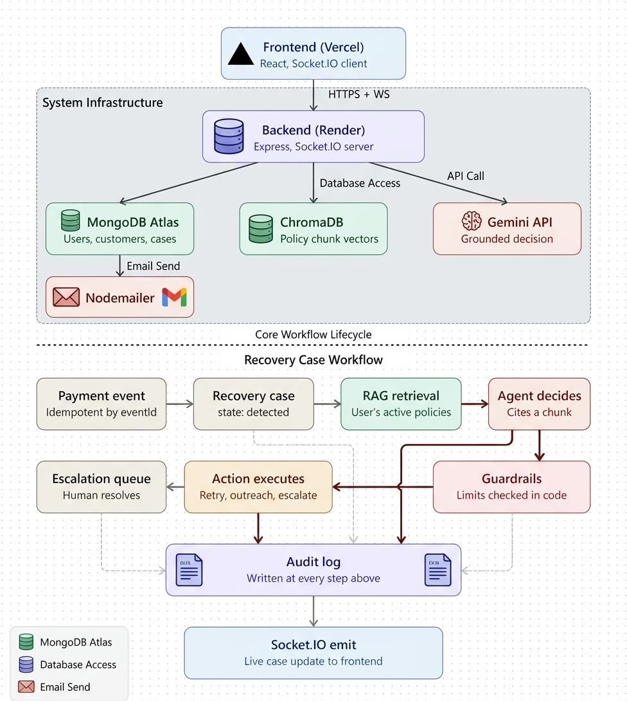

# AI REVENUE RECOVERY PLATFORM

## Project Overview
Recover.ai is an AI-powered system that automatically handles failed payments using RAG and Google Gemini. It retrieves relevant company policies from uploaded PDFs, lets the AI choose a recovery action, and uses backend guardrails to ensure every decision stays within predefined business rules. Uncertain or unsafe cases are automatically escalated to a human, while every action and decision is recorded in an audit trail.


## Live Link

https://ai-revenue-recovery-platform-beige.vercel.app

## Key features

* **AI-Powered Recovery** — Uses Gemini to determine the next recovery action.
* **RAG-Based Policies** — Grounds decisions in relevant company policies.
* **Code-Level Guardrails** — Enforces retry, outreach, and citation limits.
* **Human Escalation** — Escalates uncertain or unsafe cases for review.
* **Real-Time Updates** — Streams recovery status using Socket.IO.
* **Audit Trail** — Logs every decision, action, and outcome.

## Architecture




## Critical Engineering Functionalites

* **Policy-Grounded AI Decisions** — Retrieves relevant policy context before every AI decision.
* **Guardrail Validation** — Validates AI actions, citations, confidence, and usage limits before execution.
* **Idempotent Event Processing** — Prevents duplicate recovery cases from repeated payment events.
* **Human-in-the-Loop Escalation** — Routes unsafe or uncertain cases to a human for resolution.
* **Real-Time Case Processing** — Streams recovery state changes to the frontend using Socket.IO.
* **Audit Logging** — Records retrievals, decisions, blocked actions, and recovery outcomes.


## Build and Run

### Prerequisites

* Node.js
* MongoDB
* Docker
* Gemini API Key

### 1. Start ChromaDB

```bash
docker compose up -d
```

### 2. Backend

```bash
cd backend
npm install
npm run dev
```

Create `backend/.env`:

```env
PORT=3000
MONGO_URI=your_mongodb_uri
JWT_SECRET=your_jwt_secret
GEMINI_API_KEY=your_gemini_key
CHROMA_URL=http://localhost:8000
FRONTEND_URL=http://localhost:5173
```

### 3. Frontend

```bash
cd frontend
npm install
npm run dev
```

Create `frontend/.env`:

```env
VITE_BACKEND_URI=http://localhost:3000
```

### 4. Run the Application

Open the frontend in your browser, register an account, upload a recovery policy, create a customer, and generate a failed payment to start the recovery workflow.
